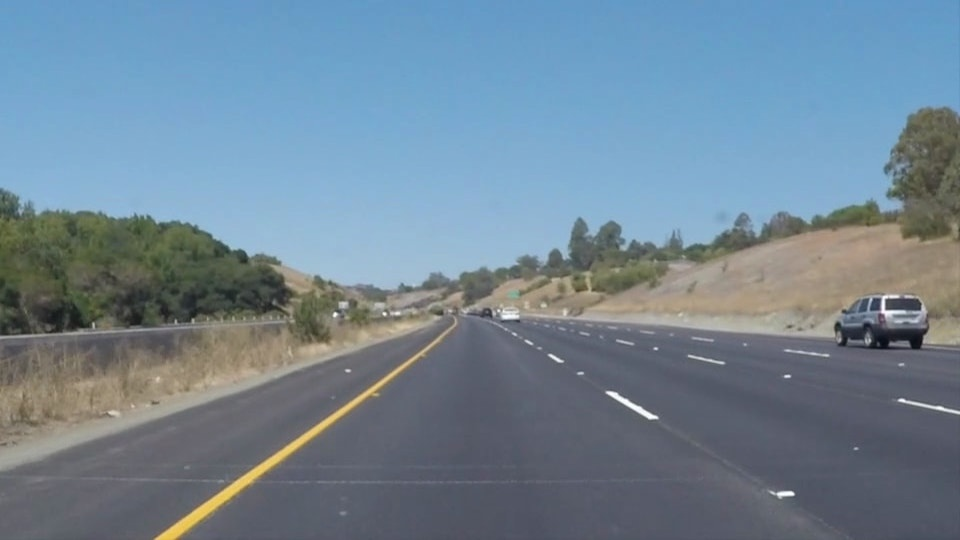
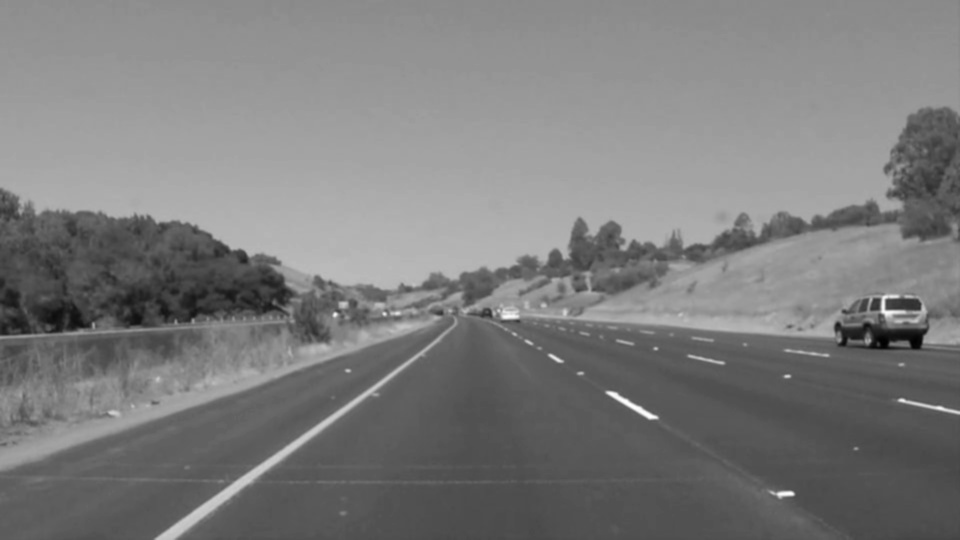
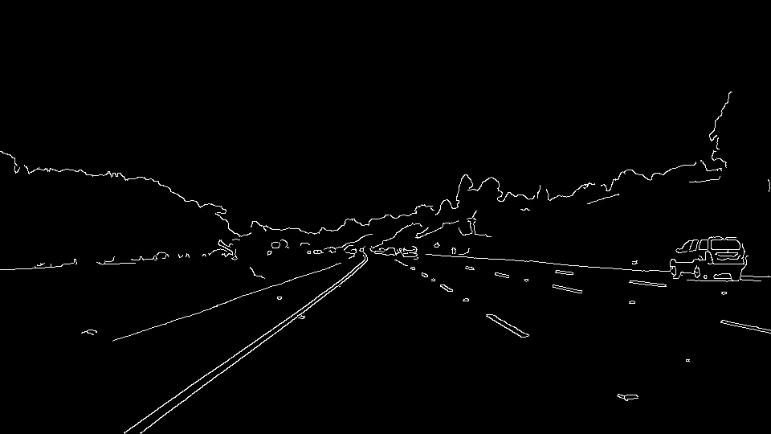
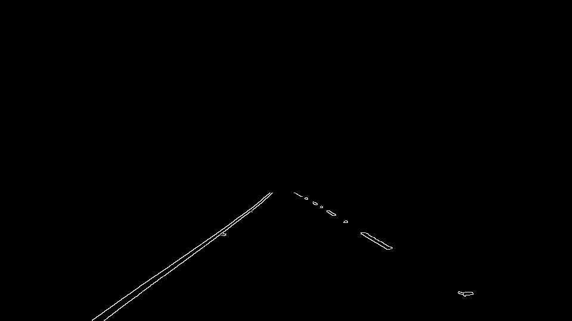
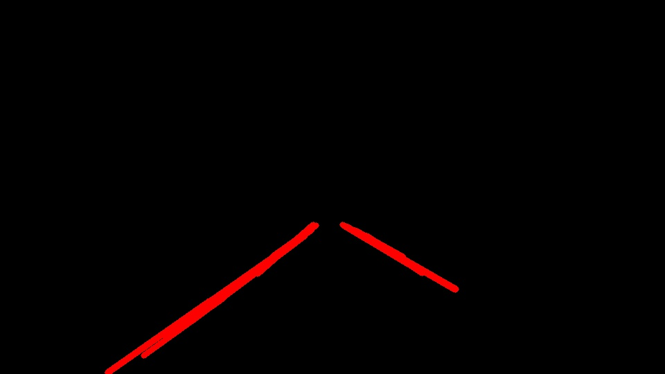
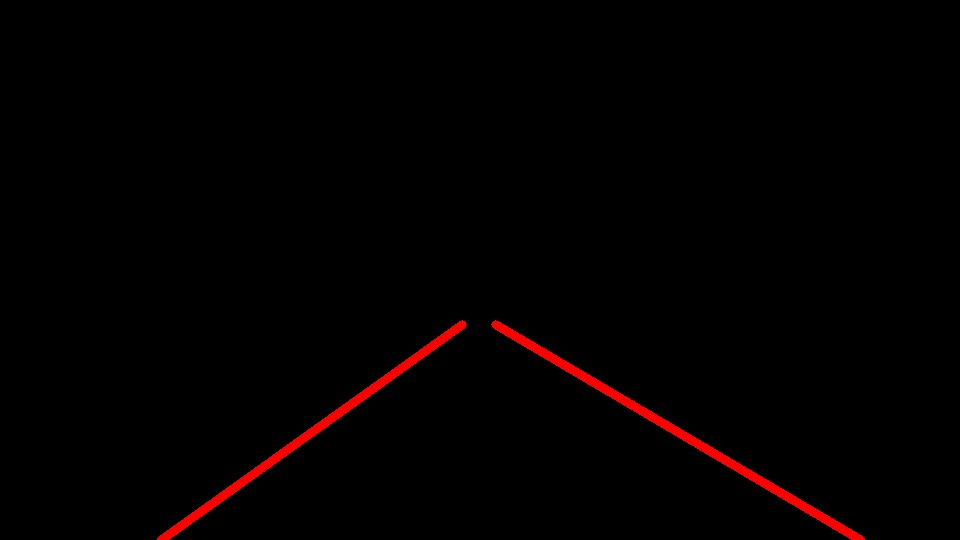
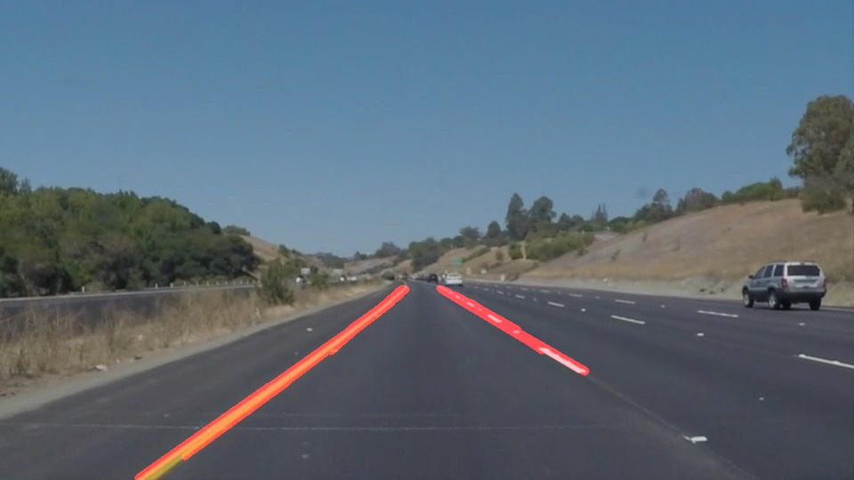
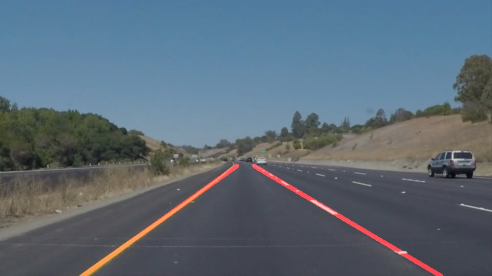

# CarND_LaneLines
## _Finding Lane Lines :: Udacity - Self-Driving Car Engineer Nanodegree_

  

### The goals / steps of this project are the following:
* Make a pipeline that finds lane lines on the road
* Reflect on your work in a written report

#### _Binder_
_Binder serves interactive notebooks online, so you can run the code and change the code within your browser without downloading the repository or installing Jupyter. Test drive online now by click the binder badge above._

---

### 1. Describe your pipeline. As part of the description, explain how you modified the draw_lines() function.

There are 6 steps in my lane finding pipeline. I will use the following camera image as an example to illustrate how the pipeline works.  
_An example of a camera image is shown in below:_  
  

1. Converted the camera images to grayscale.  
  

2. Apply Gaussian blur to reduce noise.  
  

3. Use Canny Edge Detector to extract edge information.  
  

4. Select region of interest for lane finding task.  
  

5. Perform Hough Transform to find lane lines on the road.  
    - line segments  
  
    - full extent of lane lines  
  

6. Mark the camera image with the lane lines detected in previous steps.  
    - line segments  
  
    - full extent of lane lines  
  

In Step 5 above, in order to draw a single line on the left and right lanes, I modified the **_draw_lines()_** function to perform the following operations:
* **filter** - select sensible lines by checking its slope and the difference to the current averaged slope
* **average** - only valid line slopes and intercepts are weight averaged
* **extrapolate** - estimate the full extent of lane lines using the averaged slopes and intercepts with in the region of interest

### 2. Identify potential shortcomings with your current pipeline

* the region of interest used is a fixed one, this may not work well when the camera mounting point changed, or when the road ahead is not flat
* the slope calculation may not work well when the lane line on the image is vertical
* linear extropolation on the lane lines may not work well on the curve lanes
* simple grayscale processing may not work well when there are shades on the road or under certain lighting conditions

### 3. Suggest possible improvements to your pipeline

* explore other color space in pre-processing to extract lane information when there are shades on the road
* update line extrapolation code to make it work better with curve lane lines
